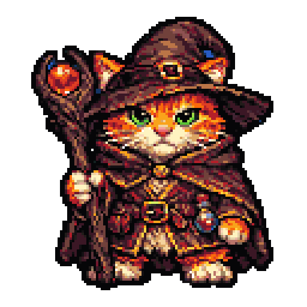
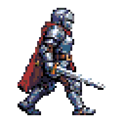
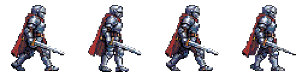

# AI Pixel Art & Tile Map Generator

A game developer toolkit for AI-generated pixel art, tile maps, sprite-sheet animations, and other game graphic assets — packaged as a [Claude Code skill](https://docs.claude.com/en/docs/claude-code/skills) on top of **OpenAI or Azure AI Foundry** (`gpt-image-2`) and **Google Gemini 2.5 Flash Image**. Outputs are Tiled-compatible (TSX/TMJ) so sprites and tilesets drop straight into your map editor.

## Examples

All generated end-to-end from a text prompt by this skill. All previews are nearest-neighbor upscaled so the pixel grid stays visible on GitHub; originals are alongside in [`assets/examples/`](assets/examples/).

### Sprites (128×128, shown at 4× = 512×512)

| Cat wizard (`aap64`) | Knight with sword and shield (`db32`) |
|:---:|:---:|
|  |  |
| `--palette aap64 --outline palette-darkest --transparent-bg` | `--palette db32 --outline palette-darkest --transparent-bg` |

### Seamless tileset (4 tiles, 32×32 each, `db32` palette via `--palette auto`)


Each tile passes the hard `tile_seam_diff_mean` gate — drop it into Tiled, paint a map, and boundaries disappear. TSX and TMJ export are next to the PNG.

### Walk-cycle animation (4 frames, 64×64 each, `db32`, 150 ms/frame)

| Animated GIF | Source sheet (4 frames, nearest-neighbor upscaled) |
|:---:|:---:|
|  |  |

Frame 0 comes from OpenAI/Azure `gpt-image-2`; frames 1–3 come from Gemini 2.5 Flash Image with frame 0 as a reference. The QA report reports `silhouette_iou_f0_f2 = 0.99`, `bbox_drift_x = 0`, `bbox_drift_y = 1` (the expected 1 px vertical bob on passing frames).

## Quickstart (Claude Code)

Paste this prompt into a fresh Claude Code session. It clones the skill, installs the Python dependencies, and walks you through credential setup interactively.

> Install the `ai-pixel-art-image-generation` skill from https://github.com/ianlintner/ai-pixel-art-image-generation into `~/.claude/skills/ai-pixel-art-image-generation`, install its Python dependencies, then ask whether I want direct OpenAI or Azure AI Foundry for `gpt-image-2`, and ask for the Gemini API key if I want animations. Don't assume — check which auth path I'm using (`OPENAI_API_KEY`, `az login`, `DefaultAzureCredential`, or a static `AZURE_OPENAI_API_KEY`), tell me which shell rc file to export the env vars in, and verify the install by generating a small sprite with `--qa`.

Once the skill is installed, Claude Code auto-discovers it via `SKILL.md` and you can ask things like "generate a 64px pixel-art knight sprite" or "make me a seamless grass-and-stone tileset for my overworld map."

## What it does

Two user-facing modes:

1. **General image generation** — text-to-image via `gpt-image-2` on OpenAI/Azure.
2. **Pixel-art game-asset mode** — OpenAI/Azure generation + nearest-neighbor downscale + named-palette quantize + (for animations) Gemini 2.5 Flash Image reference-based frame consistency + TSX/TMJ export for [Tiled](https://www.mapeditor.org/).

The skill ships deterministic QA metrics for every pipeline, with hard gates on palette fidelity, alpha crispness, tile seam continuity, and walk-cycle alignment.

## Scripts

| Script | Purpose |
|---|---|
| `scripts/generate_image.py` | General-purpose image (any subject, fixed or flexible `gpt-image-2` size). |
| `scripts/generate_sprite.py` | Single pixel-art sprite with outline and named palette. |
| `scripts/generate_tileset.py` | N unique seamless tiles packed into a sheet + TSX + TMJ. |
| `scripts/generate_animation.py` | 2–8 frame sprite-sheet animation + TSX `<animation>` block. |
| `scripts/pixelize.py` | Post-process an existing image into pixel art. |
| `scripts/qa_report.py` | Standalone QA metrics on an existing pixel-art PNG. |

## Manual install

If you prefer to install without the Claude Code quickstart prompt:

```bash
git clone https://github.com/ianlintner/ai-pixel-art-image-generation.git ~/.claude/skills/ai-pixel-art-image-generation
pip install openai azure-identity google-genai pillow rembg onnxruntime
```

## Configure

For direct OpenAI, set:

```bash
export OPENAI_API_KEY="<your-openai-api-key>"
```

For Azure AI Foundry, set:

```bash
export AZURE_OPENAI_ENDPOINT="https://<your-foundry-resource>.cognitiveservices.azure.com/"
```

For animations, also set:

```bash
export GEMINI_API_KEY="<your-gemini-api-key>"
```

Provider selection is `auto`: Azure is used when `AZURE_OPENAI_ENDPOINT` is set, otherwise direct OpenAI is used. Override with `--provider openai` or `--provider azure`. Azure auth order: Azure CLI (`az login`) → `DefaultAzureCredential` → `AZURE_OPENAI_API_KEY`.

## CLI examples

Sprite:

```bash
python3 scripts/generate_sprite.py \
  --prompt "orange tabby cat, front view, idle" \
  --size 64 --palette auto --transparent-bg --outline palette-darkest --qa \
  --output out/cat.png
```

Seamless tileset:

```bash
python3 scripts/generate_tileset.py \
  --prompt "grass, dirt, stone, water" \
  --tile-size 32 --count 4 --columns 2 --palette auto \
  --seamless auto --name overworld --output-dir out/overworld/ --qa
```

Walk-cycle animation:

```bash
python3 scripts/generate_animation.py \
  --prompt "knight walking right" --frames 4 --tile-size 32 \
  --palette db16 --action walk --transparent-bg \
  --name knight_walk --output-dir out/knight/ --qa
```

See `SKILL.md` for the full reference and `references/` for prompt-engineering, Tiled format, and palette details.

## License

MIT. See `LICENSE`.
