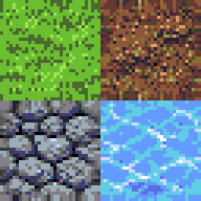

# Recipe: seamless tileset

N unique seamless tiles packed into a sheet, with matching Tiled `.tsx` (tileset) and `.tmj` (sample map) files so you can drop it straight into the editor.

## What you get

<div class="recipe-preview" markdown>

<figure markdown>
{ width=320 }
<figcaption>`overworld.png` — 4 tiles (grass, dirt, stone, water), 32×32 each, db32 palette. Preview is 4× nearest-neighbor upscaled.</figcaption>
</figure>

</div>

The same directory contains `overworld.tsx` (Tiled tileset) and `overworld.tmj` (10×10 sample map painted in Tiled). Both are generated automatically.

## Command

```bash
python3 scripts/generate_tileset.py \
  --prompt "grass, dirt, stone, water" \
  --tile-size 32 --count 4 --columns 2 \
  --palette auto --seamless auto \
  --name overworld \
  --output-dir assets/examples/tileset_overworld/ --qa
```

## Flags explained

| Flag | Meaning |
|---|---|
| `--prompt "grass, dirt, stone, water"` | Comma-separated list of tile subjects. Each becomes one tile. |
| `--tile-size 32` | Side length of each tile in pixels. |
| `--count 4` | Number of tiles. Can be less than or equal to the comma count. |
| `--columns 2` | Sheet layout: 2×2 grid. Rows computed automatically. |
| `--palette auto` | Keyword match picks `db32` for `stone` because pico8 has no mid-grey. See [Palettes](../reference/palettes.md). |
| `--seamless auto` | Try `crop` → `torus` blend → `edge_match` blend, keep the variant with the lowest `tile_seam_diff`. `edge_match` forces seams to 0 as a last resort. |
| `--qa` | Runs seam continuity + palette fidelity gates. |

## QA gates checked

- `tile_seam_diff_mean < 12.0` per tile (hard) — wrap-edges match, so placing adjacent copies in Tiled shows no seam.
- `palette_fidelity == 1.0` (hard).
- `alpha_crispness >= 0.999` (hard).

## Drop into Tiled

```bash
tiled assets/examples/tileset_overworld/overworld.tmj
```

Paint a room at 10×10 tiles; boundaries between tiles should disappear. If a particular tile shows a visible seam, rerun with `--seamless edge_match` to force continuity.

## Tips

- Keep tile count ≤ 8 per sheet for readable prompts. For larger sets, generate multiple sheets and merge in Tiled.
- For terrain variations (corners, transitions), run multiple generations with different prompts and pack manually. 47-tile Wang blob sets are deferred to a future script.
- `--bleed N` adds 1-px edge extrusion between tiles — useful for Unity/Godot to stop sub-pixel bleed when textures filter at runtime.
