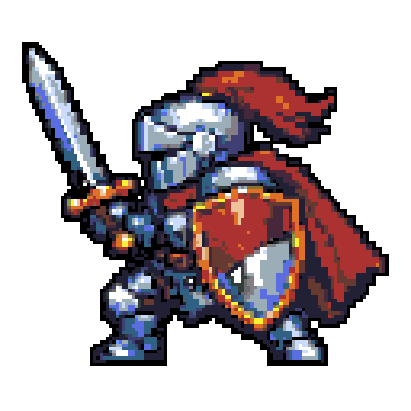
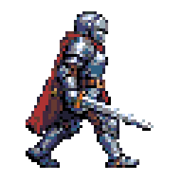

---
hide:
  - navigation
---

# AI Pixel Art & Tile Map Generator

A game developer toolkit for AI-generated pixel art, tile maps, sprite-sheet animations, and other game graphic assets — packaged as a [Claude Code skill](https://docs.claude.com/en/docs/claude-code/skills) on top of **OpenAI or Azure AI Foundry** (`gpt-image-2`) and **Google Gemini 2.5 Flash Image**. Outputs are Tiled-compatible (TSX/TMJ) so sprites and tilesets drop straight into your map editor.

<div class="gallery-grid" markdown>

<figure markdown>

<figcaption>Sprite — 128×128, aap64 palette</figcaption>
</figure>

<figure markdown>

<figcaption>Sprite — 128×128, db32 palette</figcaption>
</figure>

<figure markdown>

<figcaption>Seamless tileset — 4×32px tiles, db32</figcaption>
</figure>

<figure markdown>

<figcaption>Animation — 4-frame walk cycle, 3 fps</figcaption>
</figure>

</div>

## What it does

Two modes:

1. **General image generation** — text-to-image via `gpt-image-2` on OpenAI/Azure.
2. **Pixel-art game-asset mode** — OpenAI/Azure generation → nearest-neighbor downscale → named-palette quantize → (for animations) Gemini 2.5 Flash Image reference-based frame consistency → TSX/TMJ export for [Tiled](https://www.mapeditor.org/).

The skill ships deterministic QA metrics for every pipeline, with hard gates on palette fidelity, alpha crispness, tile seam continuity, and walk-cycle alignment.

## Quick start

### Let Claude Code install it

Paste this into a Claude Code session and it will clone the skill, install dependencies, and walk you through credential setup:

!!! tip "Quickstart prompt"
    Install the `ai-pixel-art-image-generation` skill from https://github.com/ianlintner/ai-pixel-art-image-generation into `~/.claude/skills/ai-pixel-art-image-generation`, install its Python dependencies, then ask whether I want direct OpenAI or Azure AI Foundry for `gpt-image-2`, and ask for the Gemini API key if I want animations. Don't assume — check which auth path I'm using (`OPENAI_API_KEY`, `az login`, `DefaultAzureCredential`, or a static `AZURE_OPENAI_API_KEY`), tell me which shell rc file to export the env vars in, and verify the install by generating a small sprite with `--qa`.

### Manual install

```bash
pip install openai azure-identity google-genai pillow rembg onnxruntime
# Direct OpenAI:
export OPENAI_API_KEY="<your-openai-api-key>"
# Or Azure AI Foundry:
export AZURE_OPENAI_ENDPOINT="https://<your-foundry-resource>.cognitiveservices.azure.com/"
export GEMINI_API_KEY="<your-gemini-api-key>"  # only needed for animations
```

See [Install](install.md) for the full setup, and the [Cookbook](cookbook/index.md) for recipes with example outputs.

## Cookbook

Each recipe shows the example output first, then the command that produced it.

| Recipe | What you get |
|---|---|
| [Sprite](cookbook/sprite.md) | Single pixel-art character with outline and named palette. |
| [Tileset](cookbook/tileset.md) | N unique seamless tiles packed into a sheet + Tiled TSX + TMJ. |
| [Animation](cookbook/animation.md) | 2–8 frame sprite-sheet animation + Tiled `<animation>` block + GIF. |
| [General image](cookbook/general-image.md) | Any subject, fixed or flexible `gpt-image-2` size. |
| [Pixelize existing](cookbook/pixelize.md) | Post-process an existing PNG into pixel art. |

## Reference

- [QA metrics](reference/qa.md) — hard and soft gates.
- [Palettes](reference/palettes.md) — named palette catalogue.
- [Prompt engineering](reference/prompt-engineering.md) — tips for pixel-art prompts.
- [Tiled format](reference/tiled-format.md) — TSX/TMJ export details.
